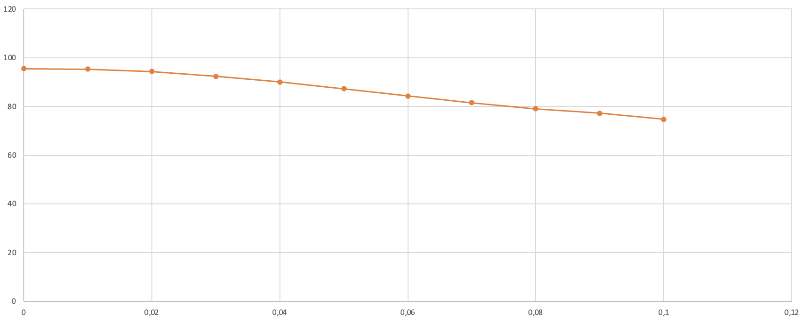
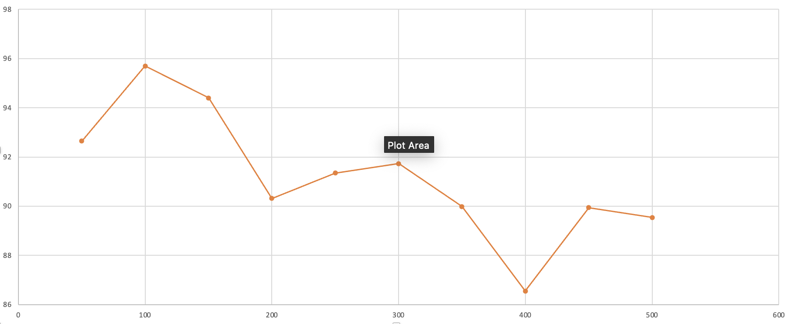
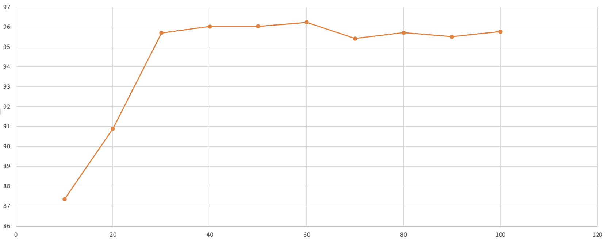

## Комп'ютерні системи імітаційного моделювання
## СПм-22-3, **Федоров Віталій Миколайович**
### Лабораторна робота №**1**. Опис імітаційних моделей та проведення обчислювальних експериментів

 

### Варіант 9, модель у середовищі NetLogo:
[Sheperds](http://www.netlogoweb.org/launch#http://www.netlogoweb.org/assets/modelslib/Sample%20Models/Biology/Shepherds.nlogo)

 

### Вербальний опис моделі:
У цьому проекті відображено інтеракцію між пастухами та вівцями. Вівці розсіяно рухаються по території, тоді як пастухи пересуваються, намагаючись зібрати їх у стадо. Можливість формування єдиного стада овець залежить від кількості пастухів та їхньої відносної швидкості руху порівняно з вівцями. Кожен пастух рухається хаотично, і коли він зустрічає вівцю, він приймає її і продовжує свій хаотичний рух. Зустрівши наступну вівцю, пастух залишає попередню в безпечному місці і продовжує пошуки наступної.

### Керуючі параметри:
- **num-shepherds** визначає кількість пастухів на полі.
- **num-sheep** визначає кількість овець на полі.
- **sheep-speed** визначає швидкість руху овець, а саме, кількість ділянок, яку вівця переміщується за кожен ігровий такт.

### Внутрішні параметри:
- **sheepless-neighborhoods**. Значення сусідніх ділянок без овець.
- **herding-efficiency**. Значення ефективності групування овець.

### Показники роботи системи:
- **herding-efficiency**, тобто ефективність роботи пастухів. Ефективність утримання стада вимірюється шляхом підрахунку кількості ділянок, у яких немає овець:
ефективність = ділянки без овець / (кількість ділянок - кількість овець).

### Примітки:
При налаштуваннях за замовченням, візуально відилити наявність стада, або декількох окремих стад, можно при ефективності вище 89%.

### Недоліки моделі:
Пастухи пересуваються хаотично, іноді забирають овець із наявних стад, та навіть не мають можливості візначити, що таке стадо та де воно.

 

## Обчислювальні експерименти
### 1. Вплив швидкості руху овець на ефективність групування
Досліджується залежність ефективності групування від швидкості руху овець. Експерименти здійснюються з використанням 30 пастухів та 150 овець протягом 11 симуляцій. Швидкість змінюється на 0.01 кожного разу, а кожна ітерація триває 5000 циклів. Для початку експерименту швидкість овець встановлюється на нуль, щоб вони залишались нерухомими. Початкове утворення єдиної групи овець, з ефективністю близько 95%, слугує стартовою точкою для подальших експериментів, під час яких швидкість поступово збільшується.

Статичні параметри:
- **num-shepherds**: 30
- **num-sheep**: 150

<table>
<thead>
<tr><th>Швидкість овець</th><th>Ефективність групування</th></tr>
</thead>
<tbody>
<tr><td>0</td><td>95,488</td></tr>
<tr><td>0,01</td><td>95,331</td></tr>
<tr><td>0,02</td><td>94,360</td></tr>
<tr><td>0,03</td><td>92,347</td></tr>
<tr><td>0,04</td><td>90,068</td></tr>
<tr><td>0,05</td><td>87,224</td></tr>
<tr><td>0,06</td><td>84,321</td></tr>
<tr><td>0,07</td><td>81,529</td></tr>
<tr><td>0,08</td><td>79,039</td></tr>
<tr><td>0,09</td><td>77,243</td></tr>
<tr><td>0,1</td><td>74,672</td></tr>
</tbody>
</table>

Графік наочно показує, що зі зростанням швидкості овець завдання пастухів щодо підтримки стад стає більш складним. Коли швидкість досягає 0,1 від швидкості пастухів, їхня присутність стає неефективною.

### 2. Вплив кількості овець на ефективність групування
Досліджується залежність ефективності групування овець від їх кількості. Експерименти проводяться з 30 пастухами при швидкості 0,02, загалом проводиться 10 симуляцій. Кількість овець змінюється з кроком у 50 голів, а кожна ітерація триває 5000 циклів.

Статичні параметри:
- **num-shepherds**: 30
- **sheep-speed**: 0,02

<table>
<thead>
<tr><th>Кількість овець</th><th>Ефективність групування (max)</th></tr>
</thead>
<tbody>
<tr><td>50</td><td>92,645</td></tr>
<tr><td>100</td><td>95,698</td></tr>
<tr><td>150</td><td>94,4</td></tr>
<tr><td>200</td><td>90,316</td></tr>
<tr><td>250</td><td>91,346</td></tr>
<tr><td>300</td><td>91,731</td></tr>
<tr><td>350</td><td>89,987</td></tr>
<tr><td>400</td><td>86,547</td></tr>
<tr><td>450</td><td>89,936</td></tr>
<tr><td>500</td><td>89,543</td></tr>
</tbody>
</table>

Графік наочно показує, що із зростанням числа овець завдання пастухів щодо утримання стада ускладнюється, однак збільшення кількості овець інколи сприяє випадковому формуванню стад.

### 3. Вплив кількості пастухів на ефективність групування

Досліджується залежність ефективності групування від кількості пастухів. Експерименти проводяться при 150 овець та швидкості 0,02, проводять 10 симуляцій з кроком зміни кількості пастухів на 10, кожна ітерація триває 5000 тактів.

Статичні параметри:
- **num-sheep**: 150
- **sheep-speed**: 0,02

<table>
<thead>
<tr><th>Кількість пастухів</th><th>Ефективність групування (max)</th></tr>
</thead>
<tbody>
<tr><td>10</td><td>87,343</td></tr>
<tr><td>20</td><td>90,89</td></tr>
<tr><td>30</td><td>95,702</td></tr>
<tr><td>40</td><td>96,02</td></tr>
<tr><td>50</td><td>96,033</td></tr>
<tr><td>60</td><td>96,233</td></tr>
<tr><td>70</td><td>95,421</td></tr>
<tr><td>80</td><td>95,707</td></tr>
<tr><td>90</td><td>95,506</td></tr>
<tr><td>100</td><td>95,762</td></tr>
</tbody>
</table>

Графік наочно показує, що зі зростанням кількості овець пастухам легше контролювати стадо. Однак, коли овець стає дуже багато, пастухи витрачають забагато часу на переміщення овець, що зменшує загальну ефективність.

