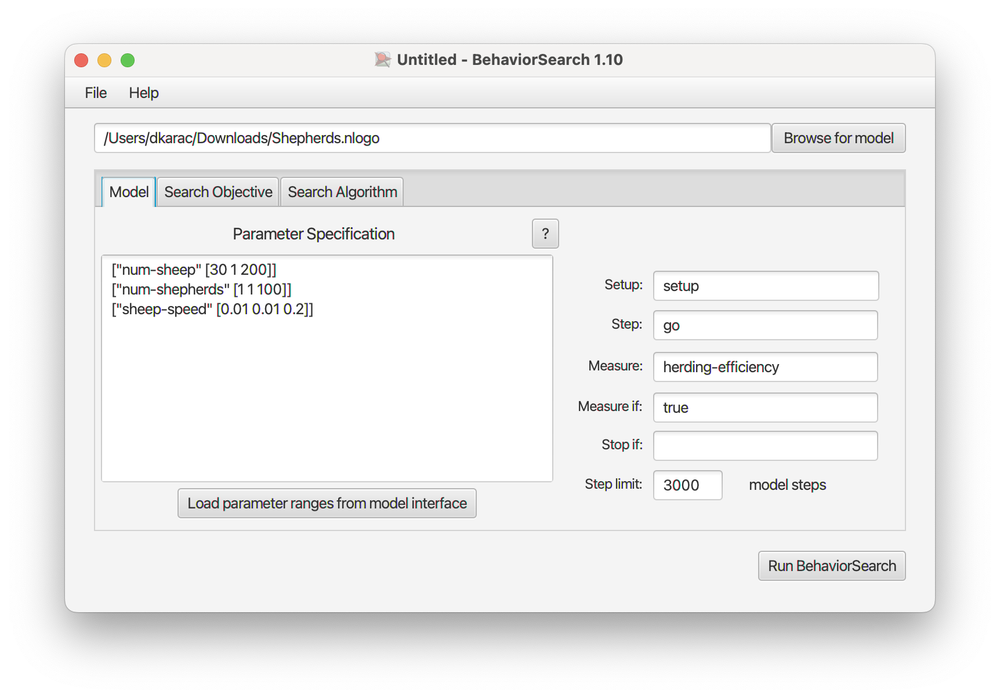
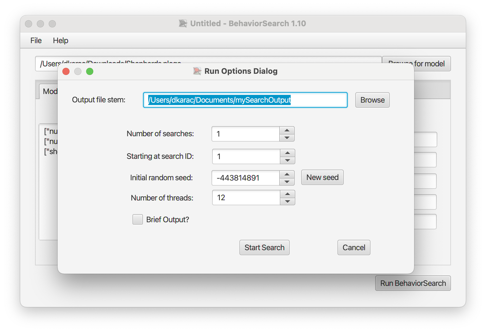
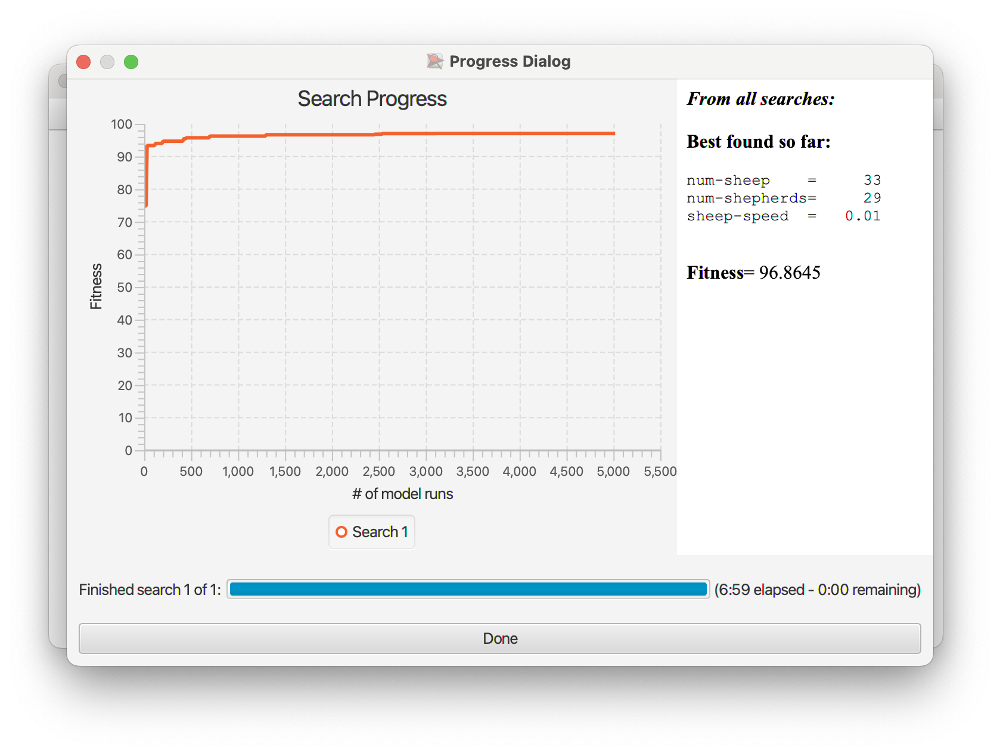
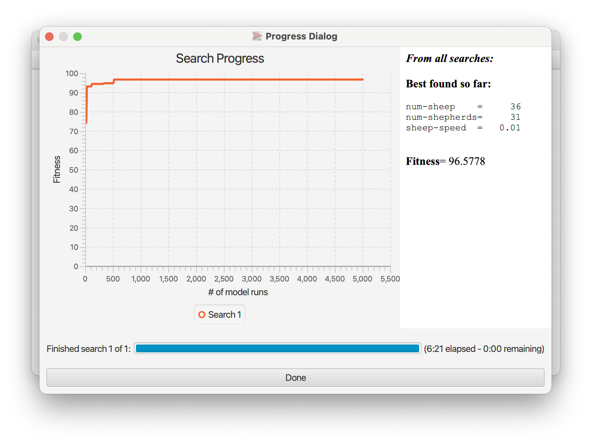

## Комп'ютерні системи імітаційного моделювання
## СПм-23-3, **Федоров Віталій Миколайович**
### Лабораторна робота №**3**. Використання засобів обчислювального интелекту для оптимізації імітаційних моделей

 

### Варіант 9, модель у середовищі NetLogo:
[Sheperds](http://www.netlogoweb.org/launch#http://www.netlogoweb.org/assets/modelslib/Sample%20Models/Biology/Shepherds.nlogo)

 

#### Вербальний опис моделі:
Симуляція, де вівці розсіюються по полю в хаотичному порядку, тоді як пастухи намагаються їх зібрати. Успіх збору стада залежить від кількості пастухів та їхньої швидкості порівняно з овцями. Кожен пастух переміщується випадково; при зустрічі з овцею він її "забирає", продовжуючи свій хаотичний рух. Якщо пастух натрапляє на іншу овцю, він залишає першу біля себе та продовжує шукати наступну.іншу.

### Керуючі параметри:
- **num-shepherds** визначає кількість пастухів, що перебувають на полі.
- **num-sheep** визначає загальну кількість овець на полі.
- **sheep-speed** визначає швидкість, з якою вівці переміщаються по полю, тобто кількість ділянок, які вівця може зробити у випадковому напрямку за один ігровий цикл.

### Показники роботи системи:
- **herding-efficiency**, ефективність пастушої роботи. Ефективність збирання стада оцінюється шляхом підрахунку кількості ділянок, які залишились без овець:
ефективність = (ділянки без овець) / (загальна кількість ділянок - кількість овець).
Цей показник виражається у відсотках.	

 

### Налаштування середовища BehaviorSearch:

**Обрана модель**:
<pre>
/Users/dkarac/Downloads/Shepherds.nlogo
</pre>
**Параметри моделі** (вкладка Model):  
*Параметри та їх модливі діапазони були автоматично вилучені середовищем BehaviorSearch із вибраної імітаційної моделі*:
<pre>
["num-sheep" [30 1 200]]
["num-shepherds" [1 1 100]]
["sheep-speed" [0.01 0.01 0.2]]
</pre>
Діапазон чисельності овець був скоригований з 30 до 200, а кількість пастухів - з 1 до 100, що менше, ніж стандартні значення, для точнішого розрахунку ефективності групування.

**Використовувана міра**:  
Для фітнес-функції (вона ж функція пристосованості або цільова функція) було обрано **значення максимальної ефективності групування**, вираз для її розрахунку взято з налаштувань графіка аналізованої імітаційної моделі в середовищі NetLogo та вказано у параметрі "**Measure**":
<pre>
	herding-efficiency
</pre>
Ефективність за весь період симуляції тривалістю, 3000 тактів, починаючи з 0 такту симуляції.   

Загальний вигляд вкладки налаштувань параметрів моделі:  

**Налаштування цільової функції** (вкладка Search Objective):  
Метою підбору параметрів імітаційної моделі, що описує групування овець, є **максимізація** значення максимального значення ефективності групування – це вказано через параметр "**Goal**" зі значенням **Maximize Fitness**. Тобто необхідно визначити такі параметри налаштувань моделі, у яких ефективності групування найвища. При цьому цікавить не просто ефективності групування у якийсь окремий момент симуляції, а максимальне її значення за всю симуляцію. Для цього у параметрі "**Collected measure**", що визначає спосіб обліку значень обраного показника, вказано **MAX_ACROSS_STEPS**.  
Щоб уникнути викривлення результатів через випадкові значення, що використовуються в логіці самої імітаційної моделі, **кожна симуляція повторюється по 10 разів**, результуюче значення розраховується як **середнє арифметичне**. 

Загальний вигляд вкладки налаштувань цільової функції:  

**Налаштування алгоритму пошуку** (вкладка Search Algorithm):  
Загальний вид вкладки налаштувань алгоритму пошуку:  

 

### Результати використання BehaviorSearch:
Діалогове вікно запуску пошуку:  

Результат пошуку параметрів імітаційної моделі, використовуючи **генетичний алгоритм**:  

Результат пошуку параметрів імітаційної моделі, використовуючи **випадковий пошук**:  

